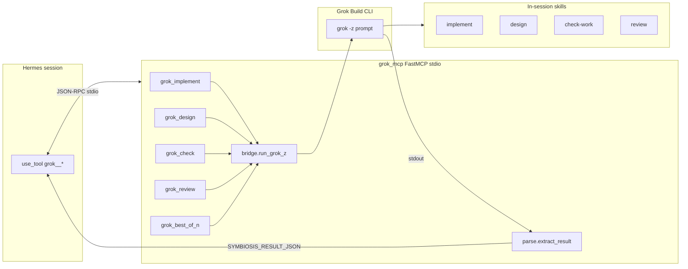
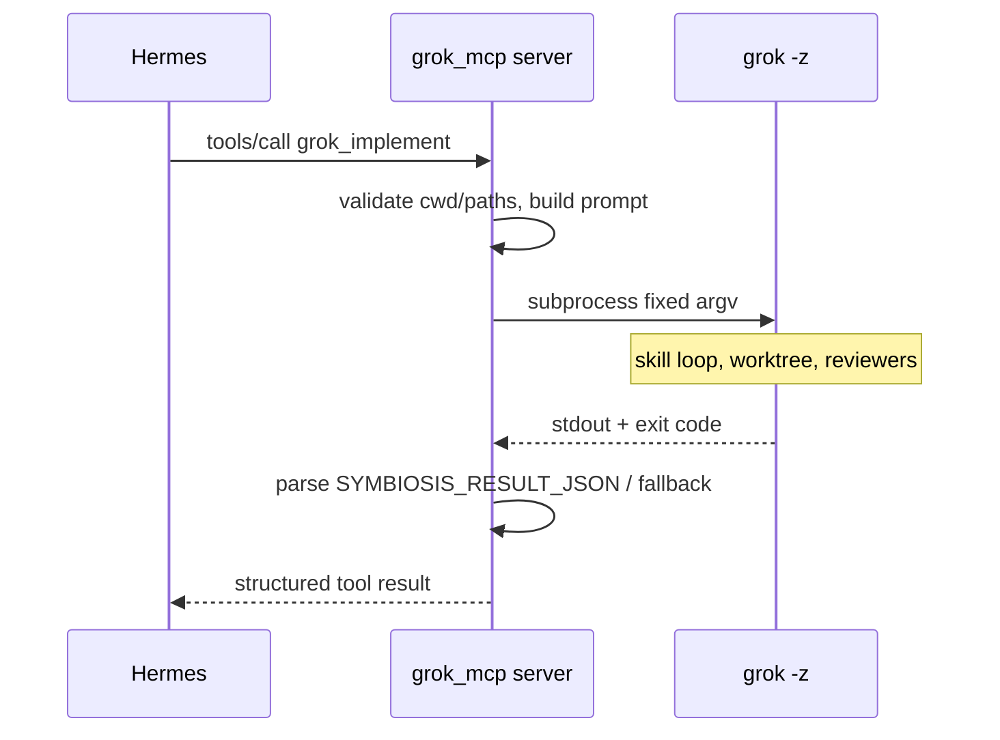

# DESIGN: `grok-mcp-server` — Native Grok Build Tools for Hermes (Symbiosis Extension)

| Field | Value |
|-------|-------|
| **AUTON_ID** | `b045169b` |
| **Project Slug** | `grok-mcp-server` / `symbiosis-grok-mcp` |
| **Status** | Design (review-ready) |
| **Date** | 2026-06-05 (Washington Linux) |
| **Canonical Research** | [`RESEARCH_SYNTHESIS.md`](./RESEARCH_SYNTHESIS.md) |
| **Implement subtree** | `cross-device/grok-mcp/` (sibling to `cross-device/scripts/`, not nested inside scripts pyproject) |
| **Ball Holder** | **Washington has the ball** (design complete → implement PR DAG → gates → mirror verify; Oregon ingests via git/Syncthing for parity). |

---

## Overview

Symbiosis already moves work **Hermes → Grok** through prose skills and shell bridges (`delegate-to-grok.sh`, `hermes-grok-delegate.ps1`, `grok -z` escalation prompts) and **Grok → Hermes** through `hermes mcp serve` in `~/.grok/config.toml`. The **#1 README roadmap item**—a Python FastMCP server exposing implement / design / check / review (and optional best-of-n)—remains unbuilt. This design specifies a **thin, dependency-light stdio MCP server** that wraps **only** fixed-argv `grok -z` invocations with skill-tuned prompts, a **structured output contract** (`SYMBIOSIS_RESULT_JSON`), per-tool timeouts, stderr-only logging, pytest + `hermes mcp test`, and **full Washington/Oregon mirror recipes** aligned with `cross-device/scripts/` and `MIRROR_KITS_AND_INFRASTRUCTURE.md` §10–§15 patterns.

**Non-goals for v1:** in-process xAI API, HTTP/SSE transport, todo_read/write proxy, native image/video MCP tools, bidirectional memory sync, Grok `config.toml` registration of this server (Hermes-first).

---

## Background & Motivation

| Shipped (recent AUTONs) | Gap |
|-------------------------|-----|
| Handoff scaffold, sync report, kanban, dashboard, joint projects, relay control plane | Hermes cannot **schema-call** Grok SE workflows like `mempalace__*` / `github__*` |
| `skills/grok-build/SKILL.md` documents delegation | Shell quoting, no structured return, weak gateway/kanban composability |
| Mempalace MCP proves custom stdio + stdout hygiene | No symmetric **`grok__*`** surface on Hermes |
| `autonomous` / relay can subprocess Grok | Long loops still depend on ad-hoc scripts, not tools |

Native MCP closes: **Hermes orchestrates → typed tool → Grok skill session → parsed JSON back**, without the model inventing shell.

---

## Goals & Non-Goals

### Goals

1. **v1 MVP tools:** `grok_implement`, `grok_design`, `grok_check`, `grok_review`, optional `grok_best_of_n`.
2. **FastMCP** stdio server package at `cross-device/grok-mcp/` with `requires-python >=3.11` (Oregon parity over WA 3.14).
3. **Security:** tool args → prompt text + validated `cwd` / paths only; **never** user-controlled `grok` argv beyond templates.
4. **Observability:** stderr logs; optional `ctx.info`; artifact paths in structured response.
5. **Mirrorability:** MIRROR §16 + linux/windows instructions + PS launcher + Pester smoke + rich `cp` recipe.
6. **Production gates:** pytest, `hermes mcp test grok` (WA+OR), `auton-gate --profile cli`, 0-issue review, verifier PASS, `check-primes.sh`.

### Non-Goals (v1)

- `grok_run_autonomous` (v1.1; document escalation path via existing relay/Slack).
- `grok_todo_*`, Imagine/image/video as first-class tools (text delegation only if needed later).
- systemd persistent server (stdio on-demand only).
- Registering this server in `~/.grok/config.toml` (optional symmetry later).

---

## Proposed Design

### Architecture (context)



### Sequence (single tool call)



### Module layout

```text
cross-device/grok-mcp/
  pyproject.toml              # symbiosis-grok-mcp, mcp[cli], pytest
  README.md
  symbiosis-grok-mcp          # bash shim → venv python -m grok_mcp
  grok_mcp/
    __init__.py               # __version__
    __main__.py               # run_stdio()
    server.py                 # FastMCP app, @mcp.tool() handlers
    bridge.py                 # subprocess: GROK_BIN, timeout, env flags
    prompts.py                # SYMBIOSIS ESCALATION + per-skill footers
    parse.py                  # extract JSON fence, VERDICT, artifacts
    paths.py                  # repo root, cwd confinement, context_paths
    config.py                 # env: GROK_BIN, timeouts, YOLO, REPO_ROOT
    logging_util.py           # stderr-only; optional stdout guard (light)
  tests/
    conftest.py
    test_parse.py
    test_paths.py
    test_bridge_mocked.py
    test_tools_schema.py
    fixtures/grok_stdout_*.txt
  PRODUCTION_READY.md         # AUTON b045169b section (implement phase)
  GATE_REPORT.md              # auton-gate evidence (implement phase)
```

**Stdout protection (v1):** Stay dependency-light (no chromadb). Use FastMCP/`ctx` logging to stderr only. If a future dep prints to stdout, copy mempalace `dup2` guard from `mempalace/mcp_server.py` (lines 27–43, 2283–2297 in grokforge venv) before heavy imports.

### Bridge (`bridge.py`)

```python
def run_grok_z(
    *,
    prompt: str,
    cwd: Path,
    timeout_sec: int,
    extra_argv: list[str] | None = None,
) -> subprocess.CompletedProcess[str]:
    grok = os.environ.get("GROK_BIN", "grok")
    argv = [grok, "-z", prompt]
    if os.environ.get("SYMBIOSIS_GROK_DELEGATE_YOLO") == "1":
        argv.extend(["--always-approve"])  # fixed flag only
    if extra_argv:
        # ONLY allowlisted tokens from config (e.g. --best-of-n, --effort)
        argv.extend(extra_argv)
    return subprocess.run(
        argv,
        cwd=str(cwd),
        capture_output=True,
        text=True,
        timeout=timeout_sec,
        check=False,
    )
```

**Forbidden:** `shell=True`, interpolating user text into argv beyond the single `-z` prompt string (which is data, not shell).

### Prompt contract (`prompts.py`)

Base block (extends `scripts/delegate-to-grok.sh`):

```text
SYMBIOSIS ESCALATION from Hermes Agent to Grok Build TUI (MCP grok__{tool}).

Working directory: {cwd}
Git context:
{git_snippet}

Task:
{task}

Context paths (read if relevant):
{context_paths_block}

Required Grok workflow: {workflow_label}  # e.g. implement with --effort N

MCP output contract — your FINAL message MUST end with:

```json SYMBIOSIS_RESULT
{
  "ok": true,
  "summary": "...",
  "verdict": "complete|pass|fail|timeout",
  "artifacts": [{"path": "...", "role": "..."}],
  "worktree_path": null,
  "notes": ""
}
```
```

For **`grok_check`**, also require line `VERDICT: PASS` or `VERDICT: FAIL` in prose (check-work skill alignment).

### Parser (`parse.py`)

1. Prefer fenced block `` ```json SYMBIOSIS_RESULT `` … `` ``` ``.
2. Fallback: last JSON object in stdout matching schema keys.
3. Fallback: `summary` = tail 4KB markdown; `ok` = (exitcode == 0).
4. Map `timeout` → `verdict: timeout`, `ok: false`.
5. Cap `raw_tail` at 8KB in tool response; full stdout path optional env `GROK_MCP_SAVE_STDOUT=1` → write under `~/.grok/logs/grok-mcp/` (implement).

---

## API / Interface Changes

### Hermes registration (new)

**Linux (Washington):**

```bash
cd ~/grok-hermes-symbiosis/cross-device/grok-mcp
python3.11 -m venv .venv
.venv/bin/pip install -e ".[dev]"
hermes mcp add grok \
  --command "$HOME/grok-hermes-symbiosis/cross-device/grok-mcp/.venv/bin/python" \
  --args "-m" "grok_mcp" \
  --env GROK_BIN="$HOME/.grok/bin/grok" \
  --env SYMBIOSIS_REPO_ROOT="$HOME/grok-hermes-symbiosis" \
  --startup-timeout-sec 15 \
  --tool-timeout-sec 600
hermes mcp test grok
```

**Windows (Oregon):** same with `Scripts\python.exe`, `grok.exe`, `C:\Users\spear\grok-hermes-symbiosis`, tool-timeout 600–3600 per tool class.

**Tool prefix:** Hermes exposes `grok__<tool_name>` when server name is `grok` (confirm with `hermes mcp list` after add; design assumes **`grok__`** not `grok_build__`).

### MCP tools (v1 schemas)

| Tool | Required args | Optional | Default timeout |
|------|---------------|----------|-----------------|
| `grok_implement` | `task: str` | `effort` 1–5, `cwd`, `context_paths[]`, `timeout_sec` | 3600 |
| `grok_design` | `task: str` | `constraints`, `cwd`, `open_questions_allowed`, `timeout_sec` | 1800 |
| `grok_check` | `focus: str` | `cwd`, `timeout_sec` | 600 |
| `grok_review` | `task: str` | `effort`, `cwd`, `timeout_sec` | 1200 |
| `grok_best_of_n` | `task: str`, `n: int` 2–5 | `cwd`, `timeout_sec` | 2400 |

**Unified return type (Pydantic model or TypedDict):**

```json
{
  "ok": true,
  "summary": "human-readable",
  "verdict": "complete",
  "artifacts": [{"path": "/abs/path", "role": "design"}],
  "worktree_path": null,
  "exit_code": 0,
  "raw_tail": "...",
  "elapsed_sec": 42.1
}
```

Hermes `tool_timeout_sec` must be **≥** per-invocation `timeout_sec` for long implement calls (document 3600 for implement in `configs/hermes-mcp-recommendations.md`).

### Before / after (delegation)

| Before | After |
|--------|-------|
| Hermes runs `hermes-grok-delegate.ps1` / prose skill | Hermes `use_tool("grok__grok_implement", {...})` |
| Unstructured stdout paste | Parsed `SYMBIOSIS_RESULT_JSON` + summary |
| Model guesses `grok` flags | Server injects skill instructions + allowlisted CLI flags |

---

## Data Model Changes

None (stateless MCP). Optional log files under `~/.grok/logs/grok-mcp/<correlation>.stdout` (implement; not in repo).

**Mempalace:** drawer `projects/grok-mcp-server` (wing `projects`) at implement verify.

---

## Alternatives Considered

| Alt | Pros | Cons | Decision |
|-----|------|------|----------|
| **A. Raw JSON-RPC** (mempalace style) | Full control, stdout guard proven | Maintenance burden, schema manual | **Reject** — use FastMCP |
| **B. In-process xAI / Grok API** | Lower latency | No stable public API; auth split | **Reject v1** |
| **C. Nest under `cross-device/scripts/grok_mcp/`** | Single pytest tree | Couples unrelated AUTON gates; Syncthing confusion | **Reject** — sibling package |
| **D. HTTP MCP service** | Persistent, remote Pi | systemd ops, token exposure | **Reject v1** |
| **E. Only document skill; no MCP** | Zero code | Roadmap #1 stays open | **Reject** |

**Selected:** FastMCP + `grok -z` CLI bridge at `cross-device/grok-mcp/`.

---

## Security & Privacy Considerations

| Threat | Mitigation |
|--------|------------|
| Shell injection via `task` | No `shell=True`; single prompt string to `-z` |
| Path traversal `cwd` / `context_paths` | Resolve under `SYMBIOSIS_REPO_ROOT` or explicit allowlist env `GROK_MCP_ALLOWED_ROOTS` (comma-separated) |
| Secret exfil in prompts | Do not pass tokens in tool args; Hermes keeps GitHub MCP separate |
| Runaway resource use | `timeout_sec` cap (max 7200 env); Hermes tool_timeout |
| YOLO permissions | Opt-in `SYMBIOSIS_GROK_DELEGATE_YOLO=1` only on dedicated symbiosis hosts; document in OPERATIONS |
| stdout corruption of MCP | stderr-only logging; optional dup2 guard |

---

## Observability

| Signal | Where |
|--------|-------|
| Tool start/end, exit code, duration | stderr JSON lines from `logging_util` |
| Parse failures | stderr + `ok: false` in result |
| Hermes-side | `hermes mcp test grok`; gateway logs |
| Smoke | `tools/smoke_grok_mcp.sh` — mock or `GROK_MCP_SMOKE_LIVE=1` tiny `-z` task |

**Metrics (v1.1):** optional counters in smoke script only; no Prometheus in v1.

---

## Rollout Plan

1. **Implement** PR DAG on Washington (worktrees per PR).
2. **WA verify:** `pytest`, `hermes mcp test grok`, live tiny implement dry task optional.
3. **Docs matrix:** README roadmap strike-through, PLAYBOOK §2.3e, skills, configs, MIRROR §16.
4. **Rich cp** to `~/Synced/grok-mempalace-integration/symbiosis-relay/` (scripts + grok-mcp + windows).
5. **Kumquat** + coordination status; **Oregon** runs §16 verify block.
6. **Rollback:** `hermes mcp remove grok`; bridges/skills unchanged.

**Feature flag:** None required; presence of MCP server is the flag. Skill text: prefer MCP when `grok__*` tools available.

---

## Production Readiness Plan

### PR DAG

Edges: **PR1 → PR2 → PR3** (core); **PR4** after PR1; **PR5** after PR2; **PR6** parallel after PR3; **PR7–PR9** docs/mirror; **PR10** gates last.

| PR | Title | Primary files | Subagent | Reviewers |
|----|-------|---------------|----------|-----------|
| **PR1** | Package skeleton + config + paths | `pyproject.toml`, `grok_mcp/config.py`, `paths.py`, `README.md` | implementer | 1 |
| **PR2** | Bridge + prompts + parse | `bridge.py`, `prompts.py`, `parse.py`, `logging_util.py` | implementer | 2 (security) |
| **PR3** | FastMCP server + 5 tools | `server.py`, `__main__.py` | implementer | 2 |
| **PR4** | pytest suite (mocked grok) | `tests/*`, `fixtures/*` | implementer | 1 |
| **PR5** | bash shim + `~/bin` | `symbiosis-grok-mcp` | implementer | 1 |
| **PR6** | Windows PS launcher + Pester | `windows/scripts/Invoke-SymbiosisGrokMcp.ps1`, `*.Tests.ps1` | implementer | 1 |
| **PR7** | Hermes registration docs | `configs/hermes-mcp-recommendations.md`, `ACTIVATE.md` | implementer | 1 |
| **PR8** | Skills + PLAYBOOK | `skills/grok-build/SKILL.md`, `cross-device/SYMBIOSIS_PLAYBOOK.md` | implementer | 1 |
| **PR9** | MIRROR §16 + coordination | `MIRROR_KITS_AND_INFRASTRUCTURE.md`, `linux-instructions.md`, `windows-instructions.md`, `coordination/status.md` | implementer | 1 |
| **PR10** | PRODUCTION_READY + auton-gate + verifier | `PRODUCTION_READY.md`, `GATE_REPORT.md`, `VERIFIER_GATE_REPORT.md` | implementer + verifier | 2 |

**Worktree note:** Use isolated git worktrees per PR (`git worktree add ../wt-b045-prN`) per symbiosis autonomous implement skill; merge stack after 0-issue review each.

**Effort → reviewers:** implement/design tools → 2 reviewers; check/review docs-only PRs → 1.

### Ops / Infra / Deploy / Verify

| ID | Task | Owner | Done when |
|----|------|-------|-----------|
| O-1 | Create venv + `pip install -e ".[dev]"` on WA | Implementer | import `grok_mcp` OK |
| O-2 | `hermes mcp add grok` (WA) | Implementer | `hermes mcp list` shows grok |
| O-3 | `hermes mcp test grok` (WA) | Verify | exit 0 |
| O-4 | `pytest tests -q` in grok-mcp | CI/local | all green |
| O-5 | Optional live smoke: tiny `grok_implement` "echo ok" | Verify | parsed `ok` or documented waiver |
| O-6 | OR: venv + add + test + Pester | Oregon | §16 block PASS |
| O-7 | Rich mirror `cp -a` grok-mcp + windows scripts | Implementer | diff vs git tag |
| O-8 | `ln -sf .../symbiosis-grok-mcp ~/bin/` | WA optional | shim in PATH |
| O-9 | Mempalace drawer `projects/grok-mcp-server` | Implementer | filed |
| O-10 | `symbiosis-kanban` lane note (if gateway live) | Ops | visible on board |
| O-11 | README Advanced roadmap item #1 struck | PR8 | grep shows Done |
| O-12 | `check-primes.sh` exit 0 | Verify | hygiene |
| O-13 | systemd for grok-mcp | **N/A v1** | stdio only |
| O-14 | Full mirror verification script | Verify | WA+OR recipes in §16 |

### CI

Add optional job `grok-mcp.yml`: `cd cross-device/grok-mcp && pip install -e ".[dev]" && pytest -q && python -m py_compile grok_mcp/*.py`. Waive monorepo lockfile s06/s08 per sibling AUTONs if parent gate runs on `scripts/` only.

---

## Key Decisions

| ID | Decision | Rationale |
|----|----------|-----------|
| KD-1 | **FastMCP** over raw JSON-RPC | Maintained schemas, `ctx` logging, aligns with research |
| KD-2 | **CLI `grok -z` only** | Same as `delegate-to-grok.sh`; only stable integration |
| KD-3 | **stdio transport** | Hermes/Grok spawn MCP children; matches mempalace/hermes |
| KD-4 | **Package path `cross-device/grok-mcp/`** | Sibling to scripts; own pyproject + auton-gate scope |
| KD-5 | **Hermes server name `grok` → `grok__*` tools** | Matches `hermes__`, `mempalace__` convention |
| KD-6 | **SYMBIOSIS_RESULT_JSON fence** | Machine-parseable; fallback prose for resilience |
| KD-7 | **YOLO via `SYMBIOSIS_GROK_DELEGATE_YOLO=1` only** | Headless permission prompts; never default in docs |
| KD-8 | **Timeouts:** implement 3600, design 1800, check 600, review 1200, best_of_n 2400 | Research + Hermes tool_timeout alignment |
| KD-9 | **Python pin `>=3.11` in pyproject** | Oregon mirror simplicity over WA 3.14 |
| KD-10 | **No `grok_run_autonomous` in v1** | Too heavy; use relay Slack NL / manual autonomous |
| KD-11 | **Skill update:** prefer MCP when tools listed | Reduces duplicate shell delegation |
| KD-12 | **auton-gate profile `cli`** | Python package + pytest; not long-running service |

---

## Open Questions

| ID | Question | Default if silent |
|----|----------|-------------------|
| OQ-1 | Exact Hermes flag names for `--startup-timeout-sec` / `--tool-timeout-sec` | Match `~/.grok/config.toml` style; verify `hermes mcp add --help` at implement |
| OQ-2 | Register server in Grok `config.toml` for meta-sessions? | **No** v1 |
| OQ-3 | `grok_best_of_n`: single `grok -z --best-of-n N` vs N subprocesses? | **Single CLI flag** when N>1 |
| OQ-4 | Enforce JSON block strictly (fail tool if missing)? | **Soft fail:** `ok` from exit code + `parse_warning` field |
| OQ-5 | Include `grok_delegate_imagine` stub in v1? | **No** — README future |
| OQ-6 | Relay prefer MCP when Hermes handles Pi task? | **Future** — document in OPEN_ITEMS |
| OQ-7 | Human: approve YOLO on Oregon desktop | Document opt-in; no auto-enable |

**Escalate to human:** Oregon Python 3.11 install path if missing; Hermes tool_timeout policy for 1h implement calls.

---

## Validation Gates

| Gate | Command / evidence |
|------|-------------------|
| V1 | `cd cross-device/grok-mcp && pytest tests -q` |
| V2 | `ruff check grok_mcp` (if ruff adopted) |
| V3 | `hermes mcp test grok` **Washington** |
| V4 | `hermes mcp test grok` **Oregon** (§16) |
| V5 | Mocked bridge tests: timeout, non-zero exit, parse fixtures |
| V6 | `auton-gate check ~/grok-hermes-symbiosis/cross-device/grok-mcp --auton-id b045169b --profile cli --checklist ~/.grok/skills/autonomous/docs/PRODUCTION_CHECKLIST.md` |
| V7 | Implement reviewer **0 critical/high** |
| V8 | Verifier subagent **VERDICT: PASS** |
| V9 | security-auditor 0 crit/high on `grok_mcp/` |
| V10 | `check-primes.sh` exit 0 |
| V11 | MIRROR §16 **Mirrorability: MET** (WA+OR verify pasted) |
| V12 | Dogfood: Hermes calls `grok__grok_check` on trivial scope (optional live) |
| V13 | `GROK_MCP_SMOKE_LIVE=1` script runs `grok -z` hello (implement) |
| V14 | PRODUCTION_READY b045169b section complete |
| V15 | CI waiver s06/s08 documented if N/A |

---

## Integration Points (doc touch list)

| File | Change |
|------|--------|
| `README.md` | Strike roadmap #1; link grok-mcp |
| `skills/grok-build/SKILL.md` | MCP-first section + tool table |
| `configs/hermes-mcp-recommendations.md` | Full `hermes mcp add grok` block + timeouts |
| `ACTIVATE.md` | grok MCP activation step |
| `cross-device/SYMBIOSIS_PLAYBOOK.md` | §2.3e Hermes→Grok MCP tools |
| `cross-device/MIRROR_KITS_AND_INFRASTRUCTURE.md` | **§16** (draft below) |
| `cross-device/coordination/linux-instructions.md` | WA verify block |
| `cross-device/coordination/windows-instructions.md` | OR verify block |
| `cross-device/coordination/OPEN_ITEMS.md` | Nice-to-have → Done when shipped |
| `cross-device/scripts/PRODUCTION_READY.md` | Optional cross-ref only (separate package PRODUCTION_READY) |
| `scripts/delegate-to-grok.sh` | Comment: prefer MCP when available |

---

## Mirrorability (design-phase draft — implement MUST execute)

**Status: MET (Washington 2026-06-05)** — §16 committed in `MIRROR_KITS_AND_INFRASTRUCTURE.md`; WA pytest + shim + docs shipped. OR verify + `hermes mcp test grok` on both hosts = PR10 gate evidence.

### Draft MIRROR_KITS §16 — `symbiosis-grok-mcp` (AUTON b045169b)

**Purpose:** Hermes-native FastMCP tools wrapping `grok -z` for implement/design/check/review/best-of-n.

**Paths (git):**

- `cross-device/grok-mcp/` (package `grok_mcp`)
- `cross-device/grok-mcp/symbiosis-grok-mcp` (shim)
- `windows/scripts/Invoke-SymbiosisGrokMcp.ps1`
- `windows/scripts/Invoke-SymbiosisGrokMcp.Tests.ps1`

**WA verify:**

```bash
cd ~/grok-hermes-symbiosis/cross-device/grok-mcp
python3.11 -m venv .venv && .venv/bin/pip install -e ".[dev]"
.venv/bin/pytest tests -q
hermes mcp test grok
~/bin/symbiosis-grok-mcp --help 2>/dev/null || true
```

**OR verify:**

```powershell
cd C:\Users\spear\grok-hermes-symbiosis\cross-device\grok-mcp
py -3.11 -m venv .venv
.\.venv\Scripts\pip install -e ".[dev]"
.\.venv\Scripts\pytest tests -q
hermes mcp test grok
Invoke-Pester C:\Users\spear\grok-hermes-symbiosis\windows\scripts\Invoke-SymbiosisGrokMcp.Tests.ps1
```

**Rich mirror:**

```bash
cp -a ~/grok-hermes-symbiosis/cross-device/grok-mcp ~/Synced/grok-mempalace-integration/symbiosis-relay/
cp -a ~/grok-hermes-symbiosis/windows/scripts/Invoke-SymbiosisGrokMcp.ps1 ~/Synced/grok-mempalace-integration/symbiosis-relay/windows/scripts/
```

**Production gate:** `cross-device/grok-mcp/PRODUCTION_READY.md` + auton-gate b045169b + verifier PASS.

**Gaps until implement:** `server.py`, real tests, PS files, `hermes mcp add` executed on both hosts, §16 committed (not draft).

---

## Risks & Mitigations

| Risk | Severity | Mitigation |
|------|----------|------------|
| Unparseable stdout | High | Prompt contract + fixtures + soft fallback |
| Implement timeout | Medium | 3600s + Hermes tool_timeout; status timeout |
| Permission prompts block `-z` | High | YOLO env doc; symbiosis hosts only |
| WA/OR Python drift | Medium | py -3.11 / python3.11 venv in §16 |
| Duplicate with skill/shell | Low | Skill MCP-first guidance |
| Leader socket contention | Low | Document serialize heavy tools |
| MCP stdout pollution | Medium | stderr-only; dup2 if deps added |

---

## References

- [`RESEARCH_SYNTHESIS.md`](./RESEARCH_SYNTHESIS.md)
- [`cross-device/scripts/pyproject.toml`](../../cross-device/scripts/pyproject.toml) — packaging pattern
- [`cross-device/scripts/kanban/cli.py`](../../cross-device/scripts/kanban/cli.py) — CLI structure
- [`scripts/delegate-to-grok.sh`](../../scripts/delegate-to-grok.sh) — prompt template
- [`skills/grok-build/SKILL.md`](../../skills/grok-build/SKILL.md)
- [`configs/hermes-mcp-recommendations.md`](../../configs/hermes-mcp-recommendations.md)
- [`cross-device/symbiosis-relay/DESIGN.md`](../../cross-device/symbiosis-relay/DESIGN.md) — PR DAG / gates template
- [MCP Python SDK](https://github.com/modelcontextprotocol/python-sdk)
- mempalace `mcp_server.py` stdout guard (local venv reference)

---

## Revision Summary

| Version | Date | Notes |
|---------|------|-------|
| 1.0 | 2026-06-05 | Initial design from RESEARCH_SYNTHESIS b045169b; skeleton package self-provisioned |

---

<!-- Edited: 2026-06-05 | Device: Washington Linux | By: Grok (design-doc-writer subagent AUTON b045169b) -->

**Ball Holder:** Washington has the ball (implement PR1 next). Bing: the roadmap’s been teasing native Grok tools like a locked vault. Bang: this design keys FastMCP + `grok -z` for Hermes. Boom: Oregon mirrors §16 after gates—keep er goinnnn.